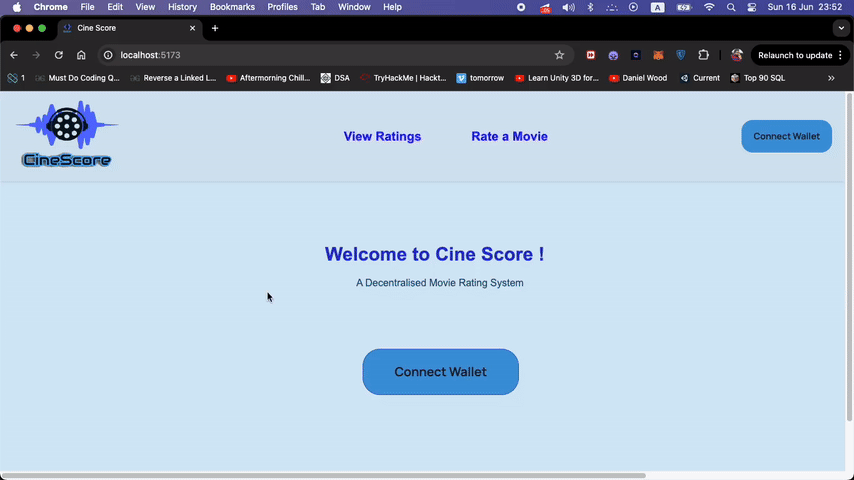

## 

# AO Process Code
Find the code for the backend AO Process here [link ](https://ide.betteridea.dev/import?id=A1zJqaE8RkOswtmuhOawvXHE2p04ovGwjtyDyTPus2A).

# CineScore: A Decentralized Movie Rating Revolution
Tired of centralized platforms influencing movie ratings? 
CineScore brings transparency and trust back to the film review process with a revolutionary decentralized movie rating system.

## What is CineScore?

CineScore leverages Arweave technology to create a tamper-proof and censorship-resistant platform for movie ratings. 

## Users can:

Submit honest reviews and ratings for their favorite (or least favorite) movies.
Gain confidence in the ratings knowing they are not manipulated by studios or biased reviewers.
Be a part of a thriving community of cinephiles who value transparency and unbiased opinions.

## Why Choose CineScore?
- **Decentralized**: Ratings are stored securely on a blockchain, eliminating the risk of manipulation or censorship.
  
- **Transparent**: Every review and rating is publicly verifiable, fostering trust in the system.
  
- **Community-Driven**: CineScore empowers users to shape the landscape of movie ratings.
  
- **Unbiased**: Free from the influence of studios and marketing campaigns, CineScore prioritizes genuine user opinions.
  
Join the CineScore Movement!

Be a part of the future of movie ratings. Download CineScore today and experience the power of a decentralized and transparent system.

